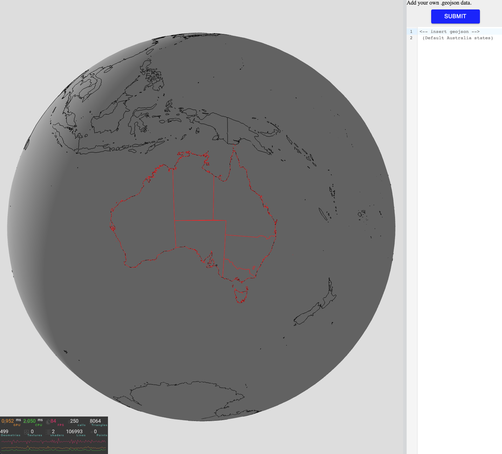

# [Geojson-visualisation](https://geojson-visualisation.kyledlong.com)


This project was built to better understand and handle geoJson data. Click submit to load the default data (Australia States) or copy paste your own data to have it rendered on the globe. Sample data can be found [here](https://d2ad6b4ur7yvpq.cloudfront.net/).

<br>




## Tech

|                   |               |
| ----------------- | ------------- |
| React Three Fiber | Drei          |
| JS                | Three.js      |
| HTML              | CSS           |
| Vite              | Github actions|
| Hostinger         | Webhooks      |


<br>

This project is a basic static website created using HTML, CSS, JavaScript, and React. For package management and development server, we use npm as the Node Package Manager along with Vite. Our Continuous Integration (CI) process involves automatically building artifacts from the main branch into the build branch whenever changes are pushed. This is achieved through GitHub Actions. Additionally, we have configured a webhook to send a POST request to a specified URL (in our case, Hostinger). As a result, any updates pushed to the main branch will trigger a build and update the production site accordingly.

<br>

## How to Use
<br>

1. Clone the repository:

```bash
git clone https://github.com/KD-Long/geojson-visualisation.git
```

2. Install the dependencies:

```bash
cd geojson-visualisation
npm install
```

3. Run the project:

```bash
npm run dev
```

3. Open your web browser and navigate to http://localhost:3000 to access the project.

<br>


## Geojson data basics:

Geojson data is a collection of features representing different types geographical features like points, lines, and polygons, along with associated attributes. Some of the common feature types are:

**LineString**   - an array of points

**Polygon**      - an array of points where [px(first),py(first)] == [px(last),py(last)] completing the polygon

**MultiPolygon** - an array of polygons

e.g:

```json
{
"type": "LineString",
    "coordinates": [
        [
            longitude1,
            latitude1        
        ],
        [
            longitude2,
            latitude2
        ]
    ],
}                   

{
  "type": "Polygon",
  "coordinates": [
    [
      [longitude1, latitude1],
      [longitude2, latitude2],
      ...
      [longitude1, latitude1]  // Repeat the first coordinate to close the polygon
    ]
  ]
}

{
  "type": "MultiPolygon",
  "coordinates": [
    [
      [  // First Polygon
        [longitude1, latitude1],
        [longitude2, latitude2],
        ...
        [longitude1, latitude1]  // Repeat the first coordinate to close the polygon
      ],
      [  // Second Polygon
        [longitude4, latitude4],
        [longitude5, latitude5],
        ...
        [longitude4, latitude4]  // Repeat the first coordinate to close the polygon
      ]
      // Additional polygons can be added here
    ],
    [
      // Coordinates for the first polygon of the second MultiPolygon
    ],
    // Additional MultiPolygons can be added here
  ]
}
```
